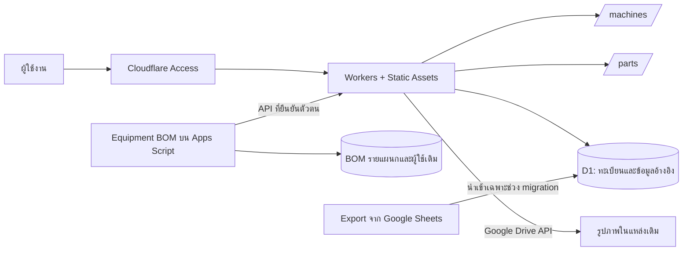

# แผนย้าย Electrical Maintenance จาก Google Apps Script ไป Cloudflare

สถานะ: ร่างสำหรับพัฒนา — ต้องตรวจข้อมูลออนไลน์และสิทธิ์จริงก่อนย้าย production  
วันที่: 20 กันยายน 2026  
ขอบเขต: Machines list, Master list, เว็บ Spare part และการเชื่อมต่อระบบที่ใช้ข้อมูลร่วมกัน

## 1. เป้าหมายและขอบเขต

ย้ายข้อมูลทะเบียนเครื่องจักรและทะเบียนอะไหล่จาก Google Sheets ไป Cloudflare D1 และย้ายหน้าเว็บกับ backend ของทะเบียนทั้งสองไป Cloudflare Workers โดยเก็บรูปภาพไว้ในแหล่งเดิม เก็บ ID เดิมเพื่อให้ BOM และลิงก์อ้างอิงใช้งานต่อได้

| รายการตามคำขอ | แหล่งเดิม | ปลายทาง / วิธีดำเนินการ |
|---|---|---|
| Machines list | [Google Sheets — gid 134597317](https://docs.google.com/spreadsheets/d/1x08c0h6iuPKLc4CSGChW1c6XmHXLBSoF1Kx8pPXbwBw/edit?gid=134597317#gid=134597317) | D1: departments, lines, machines; ตรวจชื่อแท็บจริงและความสัมพันธ์ก่อน export |
| Machines list picture | [Google Drive folder เดิม](https://drive.google.com/drive/u/0/folders/1zhjsMPg5SNiDkOqJrhQ9eE036rT2Fm3U) | คงไฟล์และ File ID เดิม; D1 เก็บข้อมูลอ้างอิง |
| Master list | [Google Sheets](https://docs.google.com/spreadsheets/d/1fnLyZPTjMnQna1QJ_lw5oABhTF3ZE4HNHqa3xxN8I9w/edit) | D1: brands, parts |
| Master list picture | [แท็บรูป — gid 2136296679](https://docs.google.com/spreadsheets/d/1fnLyZPTjMnQna1QJ_lw5oABhTF3ZE4HNHqa3xxN8I9w/edit?gid=2136296679#gid=2136296679) | คงแหล่งเดิม; ต้องยืนยันว่าเป็นลิงก์ Drive, สูตร IMAGE หรือรูปฝังในชีต |
| Spare Part | `Spare part/Index.html` | Workers Static Assets + Workers API โดยแก้ต้นฉบับใน src/ และปรับ build |

ข้อค้นพบจากโค้ด: โฟลเดอร์ **Spare part เป็น Machine Register** ไม่ใช่ระบบยอดคงคลังอะไหล่ ส่วน **Part List เป็น Master อะไหล่** จึงต้องย้าย backend ของ Part List ด้วย มิฉะนั้นหน้าแก้ไข Master เดิมจะยังเขียนลง Sheets

ไม่รวมการย้าย Stock, Purchase Requisition, ข้อมูล BOM รายแผนก หรือฐานข้อมูลผู้ใช้ของ BOM ในรอบนี้ แต่รวมการปรับ BOM ให้อ่าน Master ใหม่และแก้ลิงก์ไปยัง Part List ใหม่ งานครั้งนี้เป็นการจัดทำแผน ยังไม่ย้ายหรือแก้ไขข้อมูลออนไลน์

## 2. หลักฐานจากระบบปัจจุบันและสิ่งที่ยังไม่ยืนยัน

| หลักฐานใน workspace | ผลต่อแผน |
|---|---|
| `Spare part/gas/Code.js` กำหนด Departments, Lines, Machines และ PhotoFileID | ต้องย้ายตารางอ้างอิงพร้อมเครื่องจักร |
| `Spare part/src/app.js` ใช้ localApi เมื่อไม่พบ google.script.run | นำ HTML ไปวางบน Cloudflare อย่างเดียวจะกลายเป็นข้อมูลจำลอง ต้องเปลี่ยน transport |
| `Part List/gas/Code.js` ใช้ Parts, Brands, Picture, Thumbnail | ต้องรักษารูปเต็ม รูปย่อ และการเชื่อม Brand |
| Part List กำหนดโฟลเดอร์รูปเริ่มต้น `1XF7XgWGofEbe32NJ2LDlIAd2b7GMEJF_` และ override ด้วย DRIVE_FOLDER_ID ได้ | เป็นเบาะแสจากโค้ด ไม่ถือว่าเป็นโฟลเดอร์จริงของแท็บรูปที่ผู้ใช้ระบุ |
| `Equipment BOM/gas/Code.js`: references_(), parts_() อ่าน Sheets ทั้งสองโดยตรง | ต้องเปลี่ยนเป็นอ่าน API จาก D1 ก่อนสลับแหล่งข้อมูลหลัก |
| `Equipment BOM/src/app.js` ฝัง URL Apps Script ของ Part List | ต้องเปลี่ยน deep link และทดสอบเปิด Part เดิม |
| scripts/build.cjs ของทะเบียนทั้งสองสร้าง Index.html และคัดลอก gas/ เป็น bundle | แก้ src/ กับ backend ต้นฉบับ ห้ามแก้เฉพาะ bundle แล้วถูก build ทับ |
| Stock และ Purchase Requisition มี Wrangler + Workers + D1 configuration | ใช้แนวทาง deployment ที่สอดคล้องกัน แต่แยกฐานทะเบียนใหม่จากฐานของสองระบบนั้น |

เครื่องมือเปิดลิงก์ Google ทั้งสี่รายการไม่ได้ในการจัดทำแผนนี้ จึงยังไม่ยืนยันชื่อแท็บตาม gid, จำนวนแถว, สูตร, สิทธิ์ไฟล์, เจ้าของ Drive หรือข้อมูลที่ใช้จริงใน deployed Apps Script ต้องตรวจ Script Properties ที่ override ค่าเริ่มต้น รวมถึง trigger, macro, report และระบบนอก workspace ที่อ่านชีตเดิมด้วย

## 3. สถาปัตยกรรมเป้าหมาย

เสนอ Worker ใหม่ชื่อ `electrical-maintenance` และ D1 ใหม่ชื่อ `electrical-maintenance` แยก staging/production ชื่อเป็นข้อเสนอ ไม่ใช่ทรัพยากรที่สร้างแล้ว

- หน้าเว็บและ API อยู่ origin เดียวกัน: `/machines/`, `/parts/`, `/api/v1/*` ลดภาระ CORS และการตั้งค่า URL
- Workers ให้บริการไฟล์เว็บผ่าน Static Assets และใช้ D1 binding สำหรับข้อมูล ตาม [เอกสาร Workers Static Assets](https://developers.cloudflare.com/workers/static-assets/binding/)
- Production อ่าน/เขียนทะเบียนจาก D1 เพียงแห่งเดียวหลัง cutover; Sheets เดิมเป็น snapshot และใช้สำหรับ rollback ตามขั้นตอน
- เก็บภาพใน Google เดิม ไม่เพิ่ม R2 สำหรับภาพในขอบเขตนี้; metadata รูปอยู่ D1
- รูปของ Master ที่ตรวจพบว่าเป็นรูปฝังใน Sheets ต้องทดลองวิธีอ่านจากแหล่งเดิมให้สำเร็จก่อนอนุมัติสถาปัตยกรรมส่วนรูป ห้ามสมมติว่า Sheets URL ใช้เป็น image URL ได้

## 4. โครงสร้างข้อมูลและกติกาการแปลง

### 4.1 ตารางธุรกิจ

| ตาราง D1 | คอลัมน์เดิม → คอลัมน์ใหม่ | กติกา |
|---|---|---|
| departments | DeptID → id, DeptName → name, IsActive → is_active | คง DeptID; boolean เป็น 0/1 |
| lines | LineID → id, DeptID → department_id, LineName → name, IsActive → is_active, Remark → remark | foreign key ไป departments |
| machines | MachineID → id, MachineCode → code, MachineName → name, DeptID → department_id, LineID → line_id | คง ID และ code เดิม; line ต้องอยู่ใน department ที่เลือก |
| machines | Manufacturer, Model, SerialNo, MachineType, InstallDate, Criticality, Status, LocationDetail, ManualURL, Remark | แปลงชื่อเป็น snake_case; ความหมายคงเดิม |
| machines | PhotoFileID → photo_file_id, PhotoFileName → photo_file_name | เก็บ File ID เดิม ไม่คัดลอกไฟล์ภาพ |
| machines | CreatedAt, CreatedBy, UpdatedAt, UpdatedBy, IsActive, Version, RequestID | รักษาข้อมูลต้นทางและ version; actor ใหม่มาจากผู้ใช้ที่ยืนยันตัวตน |
| brands | Brand ID → id, Name → name, Active → is_active | คง ID; เก็บชื่อแสดงผลและ normalized_name สำหรับตรวจซ้ำ |
| parts | ID → id, Part number → part_number, Description → description, Brand → legacy_brand_name / brand_id | จับคู่ Brand ด้วย normalization เดิม; ชื่อคลุมเครือต้องแก้ mapping ก่อนนำเข้า |
| parts | Price → price_minor, Store code → store_code, อายุอุปกรณ์ (ปี) → lifespan_years, Notes → notes | ราคาเก็บจำนวนหน่วยย่อย ×100; ค่าว่างเป็น null และ 0 ยังคงเป็น 0; ยืนยันสกุลเงินจริง |
| parts | Picture → picture_source, Thumbnail → thumbnail_source | รักษาค่าต้นฉบับ และแยก File ID เมื่อยืนยันว่าเป็น Drive URL |
| parts | Created at, Updated at, Version, Request ID | รักษา timestamp, version และ request identifier เดิม |

ตารางระบบที่เสนอ: `audit_events` (ก่อน/หลังแก้ไข, actor, request_id, เวลา), `requests` (idempotency, payload hash, ผลลัพธ์), `migration_runs` (snapshot, count, hash, ข้อผิดพลาด), `image_operations` (งานรูปที่รอ commit/cleanup), `id_counters` (ถ้าต้องคงรูปแบบรหัสเรียงลำดับเดิม) และ `user_roles` สำหรับกำหนดสิทธิ์

### 4.2 กติกาสำคัญ

1. เก็บ ID, Part number, MachineCode, SerialNo, Store code เป็นข้อความ รักษาเลขศูนย์นำหน้า ไม่สร้าง ID ใหม่ให้ข้อมูลเดิม
2. วันติดตั้งเก็บเป็น `YYYY-MM-DD` ตามความหมายของ Asia/Bangkok; timestamp เก็บ ISO UTC และแสดงเวลาท้องถิ่น
3. อ่านค่าจริง ค่าที่แสดง สูตร และ hyperlink แยกกันใน export; CSV อย่างเดียวอาจทำสูตร รูป และชนิดข้อมูลหาย เก็บ workbook snapshot ประกอบ
4. เก็บ raw export เพื่อย้อนตรวจ ห้ามตัด apostrophe หรือแก้ข้อความทั้งหมดแบบเหมารวม; แปลงเฉพาะรูปแบบที่พิสูจน์ได้ว่าเป็น escape ของ Sheets
5. ไม่บังคับ unique ที่ Part number จนตรวจข้อกำหนดเดิมและข้อมูลจริง; primary key คือ ID เดิม ส่วน MachineCode ใช้กติกาการซ้ำเดิมที่ตรวจแล้ว
6. เก็บ lifecycle เครื่องจักรแยกกัน: Status = ใช้งาน/หยุด/ซ่อม/สำรอง/ปลดระวาง และ IsActive = การซ่อน/เปิดใช้รายการ ไม่รวมเป็นสถานะเดียว
7. ใช้ foreign key สำหรับตารางใน D1 และตรวจความสัมพันธ์กับ BOM ภายนอกผ่านขั้นตอนต่างหาก; foreign key ใน D1 ป้องกันรายการอ้างอิงใน Sheets ไม่ได้
8. เตรียม index สำหรับ department_id, line_id, is_active, code, part_number และ brand_id; รักษาการค้นหาภาษาไทย/หลายคำและการเรียงแบบเดิมด้วยชุดข้อมูลตัวอย่าง
9. ข้อมูลผิดรูปแบบหรือซ้ำต้องเข้ารายงาน reject พร้อมแหล่งแถว ไม่ข้ามเงียบ ๆ; ต้องไม่มี reject ที่ยังไม่ได้จัดการก่อน production

## 5. API และการปรับโปรแกรม

### 5.1 ขอบเขต API ที่เสนอ

| Endpoint | หน้าที่ |
|---|---|
| GET /api/v1/bootstrap | ข้อมูลอ้างอิง สิทธิ์ และ URL ภายในระบบ |
| GET /api/v1/machines | ค้นหา กรอง เรียงลำดับ และแบ่งหน้า |
| GET /api/v1/machines/:id | ข้อมูลเครื่องจักร |
| POST /api/v1/machines | เพิ่มเครื่องจักร |
| PATCH /api/v1/machines/:id | แก้ข้อมูลพร้อม version |
| POST /api/v1/machines/:id/lifecycle | archive, restore, retire ตามกติกาเดิม |
| DELETE /api/v1/machines/:id | ลบเมื่อผ่านสิทธิ์ version และตรวจการอ้างอิง |
| GET/POST /api/v1/parts, GET/PATCH/DELETE /api/v1/parts/:id | ทะเบียน Master อะไหล่ |
| GET/POST /api/v1/brands, POST /api/v1/brands/:id/deactivate | จัดการ Brand รวมการเปิดกลับใช้ |
| GET/PUT/DELETE /api/v1/machines/:id/photo | อ่าน เปลี่ยน หรือนำรูปออกจากรายการ |
| GET/PUT/DELETE /api/v1/parts/:id/picture | รูปเต็ม/รูปย่อ โดย GET รับ kind=full หรือ thumbnail |
| GET /api/v1/integrations/bom/references | ข้อมูลอ้างอิงสำหรับ BOM; มี revision และรองรับการแบ่งหน้าถ้าข้อมูลมาก |
| GET /api/v1/integrations/bom/parts | Part สำหรับ BOM โดยคง field mapping ที่ผู้เรียกเดิมต้องการ |

รักษารูปแบบผลลัพธ์ `{ok:true,data:...}` และ `{ok:false,error:{code,message,fields}}` เพื่อให้ frontend เดิมปรับน้อย ใช้ HTTP status ร่วมด้วย: 401 ไม่ได้ล็อกอิน, 403 ไม่มีสิทธิ์, 404 ไม่พบ, 409 version/คำขอขัดแย้ง, 422 validation, 503 บริการภายนอกขัดข้อง

ทุก mutation ส่ง requestId; แก้ไข/ลบส่ง version ด้วย รายการแบ่งหน้าส่ง items, total, page, pageSize และอนุญาตเฉพาะ sort/filter ที่กำหนด ค่า pageSize รองรับชุดเดิม 25/50/100

### 5.2 แผนแก้ไฟล์

- `Spare part/src/app.js`: เปลี่ยน rpc เป็น fetch API; mock ต้องเปิดด้วย development configuration เท่านั้น ถ้า production API ล้มเหลวให้แจ้งข้อผิดพลาด ไม่สร้างข้อมูลจำลองแทน
- `Part List/src/app.js`: เปลี่ยน transport ทุก environment ไป API ที่กำหนด รวม bootstrap, Brand, แก้รูปและ deep link
- `Spare part/src/image.js` และ `Part List/src/image.js`: ใช้การย่อรูปเดิมต่อและทดสอบ upload ผ่าน backend ใหม่
- `gas/Core.js` ของแต่ละทะเบียน: แยกกฎที่เป็น JavaScript ล้วนเป็น module ใช้ร่วมกับ Workers; แทน SpreadsheetApp, DriveApp, LockService, PropertiesService และ Utilities ใน adapter
- scripts/build.cjs: เพิ่ม build สำหรับ Workers ที่แยก output ของ `/machines/` และ `/parts/`; เก็บ GAS build ไว้สำหรับ rollback ชั่วคราว
- `Equipment BOM/gas/Code.js`: เปลี่ยน references_(), parts_() เป็น UrlFetchApp เรียก API ที่ยืนยันตัวตน; คง mapping field, DEPARTMENT_MAP และการแสดงประวัติที่อ้างรายการ inactive
- BOM: เปลี่ยน cache key เป็นรุ่นใหม่และ invalidate ตอน cutover; กำหนดเวลาข้อมูลเก่าไม่เกิน 60 วินาทีเป็นเป้าหมายที่ต้องตรวจรับ
- `Equipment BOM/src/app.js`: เปลี่ยน URL ที่ฝังไว้เป็น configuration สำหรับ `/parts/?id=PART-...`; ลิงก์เก่าที่เข้า Apps Script ให้แสดงทางไปเว็บใหม่และปิดการเขียน

### 5.3 การเขียนพร้อมกันและคำขอซ้ำ

ใช้ conditional update ตาม id + version และเพิ่ม version ในคำสั่งเดียว ถ้าไม่เปลี่ยนแถวให้คืน 409 ห้ามอ่าน version แล้ว update โดยไม่มีเงื่อนไข ใช้ unique constraint ของ requestId ที่ผูกกับ actor/operation พร้อม payload hash; คำขอซ้ำ payload เดิมคืนผลเดิม ส่วน payload ต่างกันคืน conflict

ข้อมูลธุรกิจ, audit และสถานะ request ต้อง commit ร่วมกัน ใช้ D1 batch สำหรับชุดคำสั่งที่ต้องสำเร็จหรือยกเลิกพร้อมกันตาม [D1 Database API](https://developers.cloudflare.com/d1/worker-api/d1-database/) ต้องออกแบบให้กรณี conditional update เปลี่ยน 0 แถวไม่สร้าง audit สำเร็จ เพราะ 0 แถวไม่ใช่ SQL error โดยตัวมันเอง

## 6. รูปภาพและสิทธิ์ Google

### 6.1 เส้นทางหลัก

1. นำเข้า metadata โดยคง File ID / URL เดิม ไม่ย้ายไฟล์และไม่เปลี่ยน sharing เป็น public
2. Browser ขอรูปด้วย MachineID หรือ PartID; Worker ตรวจสิทธิ์และหา File ID จาก D1 ไม่เปิด proxy ให้ส่ง URL/File ID ใด ๆ มาอ่านได้
3. Worker ตรวจขอบเขตโฟลเดอร์/ไฟล์ที่อนุญาต แล้วใช้ Drive API อ่านรูปแบบ binary; ตั้ง private/no-store เป็นค่าเริ่มต้นและไม่เก็บรูป private ใน shared cache
4. อัปโหลดรูปใหม่เข้าโฟลเดอร์เดิมและอัปเดตเฉพาะ metadata ใน D1 ตรวจชนิดไฟล์จากเนื้อหาจริงและขนาดตามข้อจำกัดเดิม
5. ถ้าไม่มี Thumbnail ให้ใช้รูปเต็มสำรองตามพฤติกรรมเดิม; ถ้ารูปเสียหรือหมดสิทธิ์ ให้ข้อมูลทะเบียนยังแสดงได้พร้อมข้อความและปุ่มลองใหม่

การอ่านไฟล์รูปจาก Drive ใช้ `files.get` กับ `alt=media` สำหรับไฟล์ binary; Google Sheets เป็นคนละชนิดกับไฟล์รูป ดู [Drive files.get](https://developers.google.com/workspace/drive/api/reference/rest/v3/files/get)

### 6.2 บัญชีเชื่อมต่อ

ตรวจว่าโฟลเดอร์เดิมอยู่ My Drive หรือ Shared Drive ก่อนเลือก credential หากอยู่ My Drive ให้ใช้ OAuth ของบัญชีที่องค์กรควบคุมและมีสิทธิ์โฟลเดอร์เดิม เก็บ refresh token/client secret ใน Workers Secrets และทดสอบ refresh token, policy และการเพิกถอนสิทธิ์ก่อน cutover หากอยู่ Shared Drive และนโยบายอนุญาตจึงเลือก service account ได้

ไม่วางแผนให้ service account เปล่าสร้างไฟล์ที่ต้องเป็นเจ้าของใน My Drive เพราะ service account ไม่มี storage quota และเป็นเจ้าของไฟล์ไม่ได้ ตาม [Google Drive: storageQuotaExceeded](https://developers.google.com/workspace/drive/api/guides/handle-errors#storagequotaexceeded)

Master picture gid 2136296679 เป็นจุดตรวจที่ยังเปิดอยู่: ถ้าเป็นลิงก์ Drive ให้ใช้เส้นทางข้างต้น ถ้าเป็นรูปฝังใน Sheets ต้องทำ proof of concept อ่านรูปจากตำแหน่งเดิมและผูกกับ PartID รวมถึงทดสอบแก้รูป ถ้าจำเป็นต้องใช้ Apps Script เป็น image adapter ชั่วคราวให้ระบุเป็นข้อยกเว้นอย่างชัดเจน ระบบส่วนรูปยังไม่ถือว่าย้ายออกจาก Apps Script เสร็จ และไม่ย้ายรูปไป Drive/R2 โดยอัตโนมัติ

### 6.3 ป้องกันรูปกับข้อมูลไม่ตรงกัน

Drive และ D1 ไม่มี transaction ร่วมกัน จึงบันทึก image operation ก่อนอัปโหลด ใช้ operation ID ผูกไฟล์ใหม่เพื่อค้นคืนหลัง timeout จากนั้น commit metadata + version + audit ใน D1 ถ้า commit ล้มเหลวให้คงรูปเดิมและจัดการไฟล์ใหม่เป็นงาน cleanup ที่ retry ได้

เก็บรูปที่ถูกแทนที่ตลอดช่วง rollback ยังไม่ย้ายเข้าถังขยะทันที เมื่อพ้นช่วง rollback จึง cleanup เฉพาะไฟล์ที่ตรวจแล้วว่าไม่มีรายการหรือระบบอื่นอ้างอยู่ การลบรายการต้องตรวจ BOM; ถ้าตรวจไม่ได้ให้ระงับ hard delete และใช้ archive จนตรวจได้ ไม่ปล่อยข้อมูลอ้างอิงขาด

## 7. การเข้าใช้งานและสถานะหน้าเว็บ

เสนอ Cloudflare Access เชื่อมบัญชีองค์กรและแยก role: viewer อ่าน, editor แก้ทะเบียน/รูป, admin จัดการสิทธิ์และงานระบบ ตรวจ JWT signature, issuer, audience, expiry ที่ Worker ตาม [Access JWT validation](https://developers.cloudflare.com/cloudflare-one/access-controls/applications/http-apps/authorization-cookie/validating-json/) และ map identity กับ role ฝั่ง server

กำหนด service identity สำหรับ BOM ให้เข้าถึงเฉพาะ integration read endpoints; เก็บ credential ที่ Script Properties ฝั่ง server ไม่ส่งเข้า HTML ป้องกันทางเข้า workers.dev/preview ที่ข้าม Access และทดสอบทุก hostname; ถ้าใช้ cookie auth ให้ตรวจ Origin และใช้มาตรการ CSRF สำหรับ mutation

| สถานะ | พฤติกรรมที่ต้องคง/เพิ่ม |
|---|---|
| กำลังโหลด | แสดง loading และป้องกันกดบันทึกซ้ำ |
| ไม่มีข้อมูล / ค้นไม่พบ | แยกข้อความให้ชัดเจน; ไม่สร้างตัวอย่างใน production |
| API ขัดข้อง | แสดง retry และคงข้อมูลที่กรอก |
| รูปโหลดไม่ได้ | แสดง placeholder โดยตารางข้อมูลยังใช้งานได้ |
| version ขัดแย้ง | แจ้งว่ามีผู้แก้ไขแล้ว ให้โหลดล่าสุดโดยไม่เขียนทับ |
| timeout หลังบันทึก | ใช้ requestId เดิมตรวจ/ลองซ้ำ ไม่สร้างคำขอใหม่โดยไม่รู้ผล |
| session หมดอายุ | ให้ล็อกอินใหม่และคงข้อมูลฟอร์มอย่างเหมาะสม |
| อยู่ในช่วง cutover | ปิดการเขียนทั้ง API และหน้าเว็บ พร้อมข้อความช่วงบำรุงรักษา |

## 8. ลำดับดำเนินงานและเกณฑ์ผ่านแต่ละระยะ

| ระยะ | งานหลัก | ผลส่งมอบ / เกณฑ์ผ่าน |
|---|---|---|
| 0 — สำรวจ | อ่านชีตจริงและ Script Properties, ตรวจ gid/headers/จำนวนแถว/รูป/consumer/เจ้าของบัญชี | source inventory, mapping, รายงานข้อมูลผิดรูปแบบ, ยืนยันวิธีเข้าถึงรูปและรายชื่อผู้ใช้ |
| 1 — เตรียมระบบ | ตั้ง staging, D1 migrations, Access/roles, Secrets, build และ log | ผู้ไม่มีสิทธิ์เข้าไม่ได้; staging แยกฐานและใช้ไฟล์ทดสอบสำหรับงานรูป |
| 2 — ย้าย backend | สร้างทะเบียน API, กฎข้อมูล, concurrency, idempotency, Drive adapter | CRUD/lifecycle/รูปผ่าน integration tests และไม่มีการเขียน Sheets จาก backend ใหม่ |
| 3 — เชื่อมหน้าเว็บ | ปรับ Spare part และ Part List จาก source, deep link, ปิด mock ใน production | ใช้งานครบเทียบระบบเดิมและ reload แล้วยังมีข้อมูลจริง |
| 4 — เชื่อม BOM | ปรับ reference API, field mapping, cache, link ไป Part List | เพิ่ม/แก้ Master แล้ว BOM เห็นข้อมูลตาม SLA; ประวัติเดิมยังแสดง |
| 5 — ทดลองนำเข้า | snapshot → normalize → staging import → reconcile และซ้อม rollback | count/ID/field hash ตรง, ไม่มี orphan, rerun ไม่เพิ่มรายการซ้ำ, ได้เวลาจริงสำหรับ cutover |
| 6 — UAT | ผู้รับผิดชอบทะเบียนทดสอบงานจริงและรับผล reconciliation | ผ่านรายการตรวจรับในหัวข้อ 10 และมีผู้รับผิดชอบตัดสิน go/no-go |
| 7 — Cutover | หยุดเขียน, export สุดท้าย, import, สลับเว็บ/API/BOM, ตรวจซ้ำ | D1 เป็นแหล่งเขียนเดียว และระบบเก่าเขียนไม่ได้จริง |
| 8 — ติดตาม | ตรวจ error, latency, failed image jobs, audit และข้อมูลอ้างอิง | แนะนำเฝ้าระวัง 7 วันทำการ; ปิด GAS เฉพาะทะเบียนที่ไม่มีผู้ใช้งาน/consumer ค้าง |

ลำดับนำเข้า: departments → lines → machines และ brands → parts จากนั้น metadata รูปและข้อมูลระบบที่จำเป็น Import ต้องผูก snapshot ID และ checksum; rerun snapshot เดิมใน staging ไม่สร้างซ้ำ และไม่ overwrite production ที่เริ่มรับงานใหม่แล้ว

ผู้รับผิดชอบที่ต้องกำหนด: เจ้าของข้อมูลตรวจ mapping/UAT, ผู้ดูแล Google ดูแล OAuth/Drive/สิทธิ์ชีต, ผู้ดูแล Cloudflare ดูแล deployment/backup, ผู้พัฒนาดูแล migration/API/BOM และผู้ควบคุม cutover หนึ่งคน ระยะเวลาให้ประเมินหลังระยะ 0 และการซ้อมนำเข้า; ยังไม่มีจำนวนแถวจริงพอให้รับรองเวลาหยุดระบบหรือค่าใช้จ่าย

## 9. Runbook สลับระบบและย้อนกลับ

### 9.1 ก่อนและระหว่าง cutover

1. สำรอง Sheets ทั้ง workbook, รายการสูตร/รูป/permission metadata, GAS source/deployment/configuration โดยเก็บ secret ในที่ปลอดภัย ไม่ลงเอกสารหรือ repo
2. สำรอง D1 ก่อนนำเข้ารอบสุดท้าย พร้อมตรวจวิธีกู้คืน และเก็บ image manifest ที่ผูก entity ID กับ File ID
3. เปิด maintenance mode ปิด mutation ของ GAS ทั้งสองทะเบียน ปิด trigger/importer และจำกัดการแก้ชีตโดยตรง; รอคำขอค้างจบ แล้วจึงบันทึกเวลา T0
4. export snapshot สุดท้ายหลังหยุดทุกผู้เขียน พร้อม hash; ตรวจอีกครั้งว่า source ไม่เปลี่ยนระหว่าง export
5. นำเข้า production ที่ยังไม่รับการเขียน ตรวจ ID set, จำนวนแถว, normalized hash ราย entity, foreign key, รูปและ BOM references; ความต่างทุกจุดต้องอธิบายได้
6. ตั้ง BOM อ่าน API ใหม่และเปลี่ยน link/config; invalidate cache จาก Sheets แล้วทดสอบดูรายการ ประวัติและ Part ที่ inactive
7. สลับ URL ใหม่และทดสอบ smoke test ด้วยบัญชีจริงตาม role ก่อนเปิด mutation ให้ผู้ใช้; เก็บ deployment เก่าพร้อม rollback
8. เปิดให้เขียน D1 เท่านั้น สร้างรายการทดสอบที่ระบุตัวตนได้ แล้วตรวจ persistence, audit, รูป, BOM และ deep link; ระบบเก่าต้องยังเขียนไม่ได้

### 9.2 เงื่อนไขและวิธีย้อนกลับ

Rollback เมื่อข้อมูลไม่ครบหรืออ้างอิงผิด, บันทึกซ้ำ/สูญหาย, สิทธิ์ผิด, หรือ flow หลักใช้งานไม่ได้และแก้ในหน้าต่าง cutover ไม่ทัน ผู้ควบคุม cutover เป็นผู้ตัดสินและบันทึกเหตุผล

- **ก่อนเปิดรับการเขียนใหม่:** ปิดเว็บ/API ใหม่ เปลี่ยน BOM และลิงก์กลับ deployment เก่า ตรวจ snapshot เดิม แล้วเปิดระบบเก่า
- **หลัง D1 มีการเขียนใหม่:** หยุดการเขียนใหม่ก่อน สำรอง D1 และ export delta ตั้งแต่ T0 จาก audit รวม create/update/delete/Brand/lifecycle/รูป ทำ reverse mapping เข้า Sheets ที่ยังถูก freeze ตรวจผลครบ แล้วจึงเปลี่ยน BOM/เว็บกลับและเปิดเขียนระบบเก่า
- หาก reverse mapping หรือ reconciliation ยังไม่ผ่าน ให้คง maintenance mode ห้ามเปิด Sheets เก่าที่ขาดรายการใหม่ และห้ามให้สองระบบรับการเขียนพร้อมกัน
- เก็บภาพเดิมและภาพใหม่ที่เกี่ยวข้องจนพ้นช่วง rollback เพื่อให้ย้อน metadata ได้โดยไม่เสียรูป
- การ restore D1 ช่วยกรณีฐาน D1 ผิดพลาด แต่ไม่เท่ากับการนำข้อมูลใหม่กลับ Sheets และไม่ย้อน Drive ให้พร้อมกัน

ใช้ Time Travel ร่วมกับ export ที่เก็บปลอดภัยและซ้อม restore ในสภาพแวดล้อมทดสอบ ระยะ Time Travel ตามเอกสารปัจจุบันคือ Free 7 วัน / Paid 30 วัน ต้องตรวจ plan ที่ใช้งานจริงก่อนกำหนด retention ตาม [D1 Time Travel](https://developers.cloudflare.com/d1/reference/time-travel/)

## 10. รายการตรวจรับ

- [ ] ID set และจำนวนรายการทุกตารางตรง snapshot ที่ยืนยัน; รายการ inactive/archived ไม่หาย
- [ ] normalized hash ครบทุก field ที่ย้าย; transformation ที่ตั้งใจมีรายงาน; ไม่มี reject หรือ orphan ค้าง
- [ ] รหัสที่มีเลขศูนย์นำหน้า ภาษาไทย ค่าว่าง/0 ราคา และวันติดตั้งไม่เปลี่ยนความหมาย
- [ ] เพิ่ม แก้ ค้นหา กรอง เรียง แบ่งหน้า archive/restore/retire และ Brand ทำงานครบ
- [ ] production ไม่มี local mock fallback และไม่มี backend ของทะเบียนเขียนลง Sheets
- [ ] แก้ไขชนกันได้ 409; request เดิม retry ได้ผลเดิม; crash/timeout ไม่สร้างรายการหรือรูปซ้ำ
- [ ] รูปเดิมอ่านได้ตามสิทธิ์; รูปใหม่ยังอยู่แหล่งเดิม; upload/commit ล้มเหลวแล้วกู้สถานะได้
- [ ] ทดลองรูปครบประเภทและตรวจ inventory ทุก File ID; missing/forbidden ที่มีอยู่เดิมต้องมีรายงานและข้อยุติก่อน cutover
- [ ] Master picture gid 2136296679 ยืนยันชนิดและทดสอบเส้นทางจริงแล้ว
- [ ] BOM อ่านเครื่องจักร/Part ใหม่ได้ ประวัติเดิมถูกต้อง deep link เปิด Part เดิมได้ และ cache ไม่เกินเป้าหมาย 60 วินาที
- [ ] ไม่ลบ Machine/Part ที่มี BOM อ้างอยู่; เมื่อระบบตรวจอ้างอิงล่มให้ปฏิเสธ hard delete
- [ ] ผู้ไม่มีสิทธิ์อ่านข้อมูลหรือรูปไม่ได้; viewer เขียนไม่ได้; service credential ของ BOM เขียนทะเบียนไม่ได้
- [ ] ทดสอบ mobile/desktop, keyboard, loading/error/empty และ session หมดอายุโดยคงงานที่กรอก
- [ ] เป้าหมาย API รายการ p95 ไม่เกิน 1 วินาทีที่ขนาดข้อมูลและจำนวนผู้ใช้พร้อมกันซึ่งตกลงในระยะ 0; วัดรูปแยกจาก API ข้อมูล
- [ ] ซ้อม rollback ทั้งก่อนและหลังมีข้อมูลใหม่ พร้อมเก็บหลักฐานว่ารายการและรูปไม่หาย
- [ ] ผู้เขียนทั้งหมดในระบบเก่าถูกปิด และทดสอบบัญชี/trigger ที่เคยเขียนจริงแล้ว

ใช้ unit tests เดิมของ MachineCore/PartCore ต่อ และเพิ่ม integration tests สำหรับ D1, authorization, idempotency และ image failure recovery ส่วน E2E เน้น flow ที่ผู้ใช้ใช้งานจริง การตรวจแผนนี้ยังไม่ได้รันทดสอบ runtime เพราะยังไม่มีการเปลี่ยนโปรแกรม

## 11. สิ่งที่ต้องสรุปก่อนลงมือ production

1. gid 134597317 และ 2136296679 ตรงแท็บใด และ Master picture เป็นรูปแบบใด; โฟลเดอร์ Part รูปจริงตรงกับ configuration หรือไม่
2. จำนวนข้อมูล ขนาดรูป สูตร และผู้เขียน/ผู้ใช้อ่านชีตทั้งหมด รวมรายงานที่ไม่ได้อยู่ใน workspace
3. บัญชี Cloudflare, domain, plan, role ผู้ใช้ และเจ้าของ Google credential; ทดสอบ upload ในโฟลเดอร์เดิมได้โดยไม่ย้ายที่เก็บ
4. หน้าต่างหยุดเขียนที่รับได้ ระยะเก็บ snapshot/รูป และผู้รับผิดชอบ go/no-go กับ rollback
5. วิธีตรวจการอ้างอิงข้าม BOM ก่อน hard delete และข้อตกลงเก็บข้อมูลประวัติ

เมื่อระยะ 0 ปิดประเด็นเหล่านี้ได้ ให้ปรับเอกสารเป็น Approved และใช้ระยะ 1–8 เป็นลำดับพัฒนาและย้ายจริง
