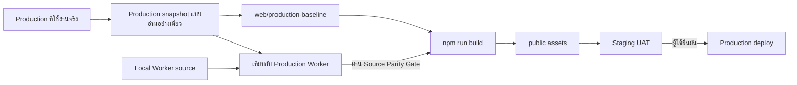

# แผน Rebase ระบบ Electrical Maintenance จาก Production Baseline

**สถานะ:** กำลังดำเนินการ  
**วันที่จัดทำ:** 22 กันยายน 2026  
**เป้าหมาย:** ใช้ระบบที่ Deploy อยู่บน Production เป็น baseline ที่ตรวจสอบได้ก่อน แล้วจึงย้ายการพัฒนาฟีเจอร์ใหม่กลับเข้ามาอย่างเป็นขั้นตอน โดยไม่ให้ Staging ต่างจาก Production เพราะใช้ source เก่า

## 1. ปัญหาและหลักการทำงาน

Staging เคยถูก build จาก source ใน workspace ซึ่งไม่ตรงกับหน้าเว็บที่ใช้งานจริงบน Production จึงเกิดความต่างของหน้าจอและพฤติกรรมหลายจุด แม้การแก้ไขบางอย่างจะผ่านการทดสอบใน source เดิมแล้วก็ตาม

ตั้งแต่นี้ Production คือจุดอ้างอิงของ UI และพฤติกรรมปัจจุบัน งานใหม่ต้องเริ่มจาก baseline นี้ และต้องผ่านการเทียบความเหมือนก่อน deploy ทุกครั้ง



## 2. สิ่งที่ทำแล้ว

| รายการ | สถานะ | รายละเอียด |
| --- | --- | --- |
| เก็บ snapshot ของ Production | เสร็จแล้ว | อยู่ที่ `.production-snapshot/` และถูก ignore จาก Git เพื่อไม่เก็บ export หรือข้อมูลฐานข้อมูลใน repository |
| กำหนด UI baseline | เสร็จแล้ว | เก็บหน้า `machines`, `parts`, `bom`, `users` ที่ตรงกับ Production ไว้ใน `web/production-baseline/` |
| Reset Staging UI | เสร็จแล้ว | Static assets ของ Staging ตรงกับ Production สำหรับทั้ง 4 หน้าตาม hash ที่ตรวจสอบแล้ว |
| ป้องกัน build จาก source เก่า | เสร็จแล้ว | `scripts/build.mjs` ใช้ baseline asset เมื่อมีไฟล์อยู่ใน `web/production-baseline/` |
| ปรับ D1 index บน Staging | เสร็จแล้ว | เพิ่ม index สำหรับรายการอุปกรณ์และประวัติการทำงาน; Production ยังไม่ถูกแก้ไข |
| ฟีเจอร์ BOM รอบก่อน | ยังไม่นำกลับเข้า Staging | โค้ดยังอยู่ใน source เดิมเพื่อใช้เป็น reference แต่ Staging ถูกคืนเป็น baseline ของ Production แล้ว |

## 3. ขอบเขตงาน

### 3.1 ทำให้ source แก้ไขต่อได้โดยยังเหมือน Production

1. สร้างรายการหน้าและ owner source ของ `machines`, `parts`, `bom`, `users` จาก baseline ปัจจุบัน
2. เปรียบเทียบ route, authentication, cookie, API response, และ schema ระหว่าง Worker source ใน workspace กับ Worker ที่ download จาก Production
3. แยกความต่างเป็นสามกลุ่ม: UI, API/Worker, และข้อมูล D1
4. เขียน regression test สำหรับพฤติกรรมสำคัญที่พบใน Production ก่อนเริ่มย้ายฟีเจอร์
5. ย้ายหรือสร้าง source ที่เป็นเจ้าของแต่ละหน้าอย่างชัดเจน แล้ว build ออกมาเทียบ hash/DOM กับ baseline

`web/production-baseline/` เป็น release artifact เพื่อคุมความปลอดภัยระหว่าง rebase ไม่ใช่ source หลักระยะยาว เมื่อ source parity ผ่านแล้ว ให้ย้ายกลับไปใช้ source ที่แก้ไขได้และเก็บ baseline ไว้เป็น regression fixture

### 3.2 ฟีเจอร์ **อุปกรณ์ประจำเครื่องจักร (BOM)**

นำฟีเจอร์กลับเข้า source ที่ผ่าน Source Parity Gate แล้วเท่านั้น

| ความต้องการ | แนวทางพัฒนา | เกณฑ์รับงาน |
| --- | --- | --- |
| กดรูป Part เพื่อดูรายละเอียด | รูปเป็นปุ่มที่เข้าถึงด้วยคีย์บอร์ดได้ เปิด dialog/detail panel ของ Part โดยใช้ข้อมูลที่มีในรายการ | คลิกและกด Enter/Space ได้, ไม่เปิด/ปิดรายการ BOM โดยไม่ตั้งใจ, ไม่สร้าง D1 read เพิ่มต่อรายการ |
| `✎ Part Edit` | สร้าง URL ด้วย Part ID ที่ encode แล้ว: `/parts/?id=<PartID>` | เปิด Part ที่ถูกต้องจากทุก BOM row; Part ID ที่มีอักขระพิเศษไม่ทำให้ URL เสีย |
| หน้าจอเล็ก | ออกแบบ layout สำหรับ 360px ขึ้นไปโดยเฉพาะ: header ย่อ, filter เรียงแนวตั้ง, card/list อ่านง่าย, action ติดขอบล่างเมื่อจำเป็น | ไม่เกิด horizontal scroll, ปุ่มแตะง่าย, dialog เพิ่มอุปกรณ์ใช้งานและบันทึกได้บนจอเล็ก |
| คงพฤติกรรมเดิม | คงการเลือกพื้นที่, เลือกเครื่องจักร, ค้นหา, filter, expand, จำนวน และการแก้ Label | UAT ทุก flow ผ่านเทียบกับ Production baseline |

### 3.3 แผนลด D1 Rows read

เป้าหมายคือใช้ข้อมูลเท่าที่จำเป็นต่อหน้าจอ และวัดผลจาก D1 Analytics หลัง deploy Staging ไม่ปรับ query เพิ่มบน Production จนกว่า Worker parity จะผ่าน

1. ใช้ index ที่เพิ่มบน Staging แล้วสำหรับ query ตาม `machine_id`, `record_status/status` และเวลา
2. ส่งเฉพาะ Part ที่ปรากฏในรายการ/ประวัติของเครื่องนั้น แทนการอ่าน Part master ทั้งชุด
3. เปิดรายละเอียดจากข้อมูลที่โหลดแล้วก่อน; เรียก API เพิ่มเฉพาะเมื่อข้อมูล detail ยังไม่มี
4. ทำ pagination และกำหนด page size ตามขนาดหน้าจอ; หลีกเลี่ยงการโหลดทุกรายการพร้อมกัน
5. debounce การค้นหา และยกเลิก request เก่าระหว่างพิมพ์
6. เพิ่ม metrics ใน response/log สำหรับจำนวน row, route และเวลา query โดยไม่บันทึกข้อมูลผู้ใช้ที่ละเอียดอ่อน
7. ตรวจ `EXPLAIN QUERY PLAN` ของ query สำคัญให้ใช้ index และทดสอบกับเครื่องที่มีรายการมาก

**เป้าหมายวัดผล:** ลด Rows read ของ route BOM อย่างน้อย 70% จากค่า baseline หลังเก็บข้อมูลใช้งานจริงช่วงเดียวกัน และไม่เพิ่ม latency p95 หรือจำนวน error

## 4. ลำดับการดำเนินงาน

### Phase 0 — Baseline Gate (เสร็จแล้ว)

- Snapshot Production แบบอ่านอย่างเดียว
- กำหนด static baseline 4 หน้า
- Deploy Staging ให้ตรงกับ Production และตรวจ hash
- บันทึก Worker version ของ Staging ไว้สำหรับ rollback

### Phase 1 — Source Parity

1. สร้าง baseline manifest: URL, hash, route, API calls และพฤติกรรมสำคัญของแต่ละหน้า
2. ตรวจความต่างของ frontend bundle กับ source แต่ละ module
3. ตรวจความต่างของ Worker โดยเฉพาะ authentication, route mapping, D1 query และ migration history
4. สร้าง/ปรับ regression test ให้ครอบคลุมพฤติกรรมจาก Production
5. ย้าย owner source ทีละหน้าและ build เทียบ baseline ก่อนย้ายหน้าถัดไป

**ผ่าน Phase 1 เมื่อ:** หน้าเดิมไม่มี UI/API regression ที่ตรวจพบ, tests ผ่าน และผล build ตรงกับ baseline ในส่วนที่ยังไม่มีฟีเจอร์ใหม่

### Phase 2 — BOM Feature Branch บน Staging

1. เพิ่ม dialog รายละเอียดเมื่อกดรูป Part
2. เพิ่มลิงก์ Part Edit ไป `/parts/?id=...`
3. ทำ mobile-specific layout และทดสอบที่ 360, 390, 768 และ desktop
4. ใช้ query/index ที่ผ่านการตรวจ query plan แล้ว
5. Deploy เฉพาะ Staging พร้อม release note และ checklist UAT

### Phase 3 — วัดผลและ UAT

1. เปรียบเทียบ Rows read, query duration, error rate และ p95 latency กับ baseline
2. ให้ผู้ใช้ทดสอบเลือกเครื่อง, ค้นหา, filter, expand, เพิ่ม Label, เปิดรายละเอียด และแก้ Part
3. เก็บ defect แล้วแก้บน Staging จนผ่าน acceptance criteria

### Phase 4 — Production Release

1. Freeze เวอร์ชัน Staging ที่ผ่าน UAT
2. ตรวจ diff ของ static assets, Worker routes และ D1 migrations อีกครั้ง
3. Deploy Production หลังผู้ใช้ยืนยันผล UAT
4. เฝ้าดู error rate, latency และ Rows read หลังปล่อยงาน

## 5. Gate ก่อน Deploy

| Gate | หลักฐานที่ต้องมี | ผู้รับผิดชอบการตัดสินใจ |
| --- | --- | --- |
| Baseline Gate | hash ของหน้า Production และ Staging ตรงกัน | ทีมพัฒนา |
| Source Parity Gate | source map/behavior checklist, build/test ผ่าน, ไม่มี regression | ทีมพัฒนา |
| Staging Feature Gate | desktop/mobile test, API test, query plan, Rows read metrics ผ่านเป้าหมาย | ทีมพัฒนา |
| UAT Gate | ผู้ใช้ทดสอบ workflow จริงและยืนยัน | ผู้ใช้/เจ้าของระบบ |
| Production Gate | release version และ rollback version ระบุชัด | ผู้ใช้/เจ้าของระบบ |

## 6. การทดสอบ

### ตรวจ build และ source

```powershell
Set-Location 'E:\Antigravity\Web App\Electrical Maintenance'
npm run build
npm run check
npm test
```

หลัง build ให้เปรียบเทียบ hash ของ `public/machines`, `public/parts`, `public/bom`, `public/users` กับ `web/production-baseline/` สำหรับหน้าที่ยังไม่ได้เริ่มเพิ่มฟีเจอร์

### ตรวจ Staging

- ตรวจ static asset hash ของ Staging เทียบ Production ทั้ง 4 หน้า
- ตรวจ login/session และสิทธิ์ผู้ใช้โดยไม่ใช้ credential ใน test script
- BOM: เลือกพื้นที่และเครื่อง, ค้นหา, filter, expand/collapse, เปิดรูป, Part Edit, แก้ Label, เพิ่มอุปกรณ์
- Mobile: 360px และ 390px ไม่มี horizontal scroll และแตะ action ได้ครบ
- D1: ตรวจ query plan, Rows read, p95 latency และ error rate

## 7. Rollback

หาก Staging มี regression ให้ restore static baseline ที่ตรวจ hash แล้วและ deploy กลับไปยัง Worker version ก่อนหน้า การเพิ่ม D1 index เป็น additive จึงไม่ลบ index ทันที; จะลบได้ต่อเมื่อมี migration rollback แยกและมีผล query plan ยืนยันว่าจำเป็น

Production จะไม่มีการแก้ไขใน Phase 1–3 และจะ deploy หลัง UAT Gate เท่านั้น

## 8. ข้อจำกัดและสิ่งที่ไม่ทำในรอบนี้

- ไม่ overwrite Production เพื่อใช้เป็นวิธีทดสอบ
- ไม่ commit snapshot, D1 export หรือข้อมูลที่อาจมีความละเอียดอ่อน
- ไม่ใช้ source เก่ามา build แล้ว deploy ทับ Staging หากยังไม่ผ่าน Source Parity Gate
- ไม่ทำให้พฤติกรรมเดิมของ Production เปลี่ยนเพียงเพื่อให้โค้ดเก่าทำงานได้

## 9. Acceptance Checklist

- [x] Staging กลับมาตรงกับ Production สำหรับหน้า `machines`, `parts`, `bom`, `users`
- [x] มี snapshot และ baseline asset ที่ตรวจสอบย้อนกลับได้
- [x] มี build guard ป้องกัน source เก่าทับ baseline
- [x] เพิ่ม D1 index บน Staging และยืนยัน query plan
- [x] ทำ baseline manifest และ source ownership map (บันทึกไว้ใน `baseline-manifest.md`)
- [x] Worker source parity ผ่านก่อนเปลี่ยน backend เพิ่ม (ซิงค์ Core, Service, Repository, D1 query optimization)
- [x] ฟีเจอร์กดรูป Part และ Part Edit อยู่บน source ที่ parity แล้ว และ deploy ขึ้น Staging สำเร็จ
- [ ] Mobile BOM ผ่านการทดสอบ 360px และ 390px (พร้อมให้ผู้ใช้ทดสอบบน Staging)
- [ ] Rows read ลดลงตามเป้าหมายจากข้อมูล Staging
- [ ] ผู้ใช้ UAT ผ่านและอนุมัติ Production release
